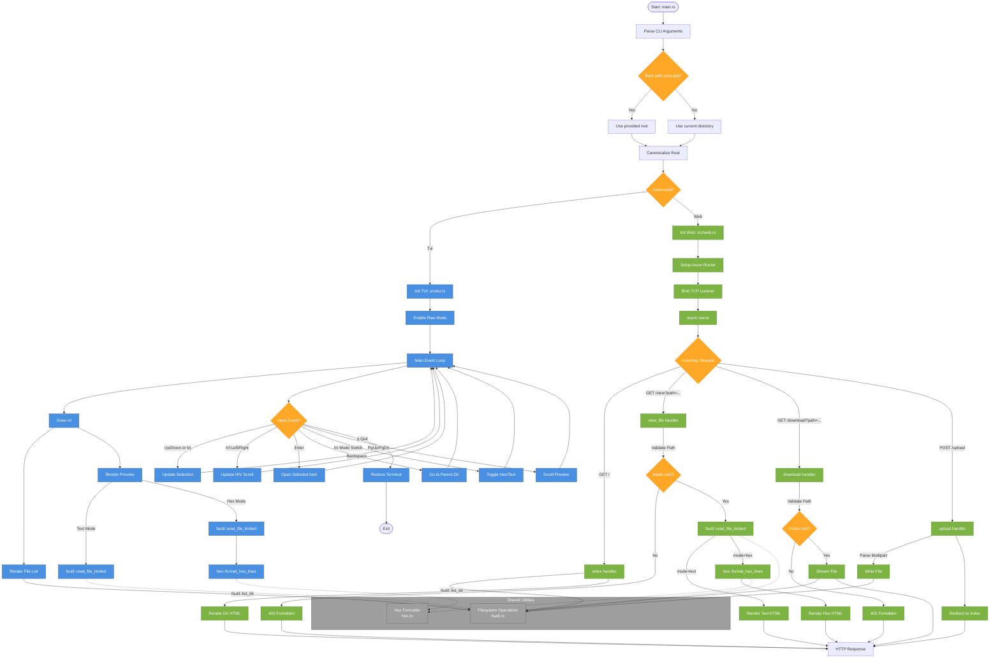

```mermaid
flowchart TD
    Start([Start: main.rs]) --> ParseArgs[Parse CLI Arguments]
    ParseArgs --> DetermineRoot{Root path provided?}
    DetermineRoot -- Yes --> SetRoot[Use provided root]
    DetermineRoot -- No --> CurrentDir[Use current directory]
    SetRoot --> ResolveRoot[Canonicalize Root]
    CurrentDir --> ResolveRoot
    ResolveRoot --> CheckCommand{Command?}

    %% TUI Branch - Blue theme
    CheckCommand -- Tui --> InitTUI[Init TUI: src/tui.rs]
    InitTUI --> EnableRaw[Enable Raw Mode]
    EnableRaw --> TuiLoop[Main Event Loop]
    TuiLoop --> DrawUI[Draw UI]
    DrawUI --> RenderList[Render File List]
    DrawUI --> RenderPreview[Render Preview]
    RenderList -- fsutil::list_dir --> FS[Filesystem]
    RenderPreview -- Text Mode --> ReadFileTui[fsutil::read_file_limited]
    RenderPreview -- Hex Mode --> ReadFileHexTui[fsutil::read_file_limited]
    ReadFileHexTui --> FormatHexTui[hex::format_hex_lines]
    
    TuiLoop --> HandleInput{Input Event?}
    HandleInput -- "Up/Down or k/j" --> UpdateNav[Update Selection]
    HandleInput -- "h/l Left/Right" --> UpdateScroll[Update H/V Scroll]
    HandleInput -- "Enter" --> OpenFile[Open Selected Item]
    HandleInput -- "Backspace" --> GoUp[Go to Parent Dir]
    HandleInput -- "t/x Mode Switch" --> UpdateMode[Toggle Hex/Text]
    HandleInput -- "PgUp/PgDn" --> PageScroll[Scroll Preview]
    HandleInput -- "q Quit" --> RestoreTerm[Restore Terminal]
    UpdateNav --> TuiLoop
    UpdateScroll --> TuiLoop
    OpenFile --> TuiLoop
    GoUp --> TuiLoop
    UpdateMode --> TuiLoop
    PageScroll --> TuiLoop
    RestoreTerm --> Exit([Exit])

    %% Web Branch - Green theme
    CheckCommand -- Web --> InitWeb[Init Web: src/web.rs]
    InitWeb --> SetupRouter[Setup Axum Router]
    SetupRouter --> BindAddr[Bind TCP Listener]
    BindAddr --> Serve[axum::serve]
    
    Serve --> Request{Incoming Request}
    
    Request -- "GET /" --> Index[index handler]
    Index -- fsutil::list_dir --> FS
    Index --> RenderHTML[Render Dir HTML]
    
    Request -- "GET /view?path=..." --> View[view_file handler]
    View -- Validate Path --> CheckRoot{Inside root?}
    CheckRoot -- No --> Error403[403 Forbidden]
    CheckRoot -- Yes --> ReadFileWeb[fsutil::read_file_limited]
    ReadFileWeb -- "mode=text" --> RenderText[Render Text HTML]
    ReadFileWeb -- "mode=hex" --> FormatHexWeb[hex::format_hex_lines]
    FormatHexWeb --> RenderHex[Render Hex HTML]
    
    Request -- "GET /download?path=..." --> Download[download handler]
    Download -- Validate Path --> CheckRoot2{Inside root?}
    CheckRoot2 -- No --> Error403_2[403 Forbidden]
    CheckRoot2 -- Yes --> StreamFile[Stream File]
    StreamFile --> FS
    
    Request -- "POST /upload" --> Upload[upload handler]
    Upload -- Parse Multipart --> SaveFile[Write File]
    SaveFile --> FS
    Upload --> Redirect[Redirect to Index]
    
    RenderHTML --> Response[HTTP Response]
    RenderText --> Response
    RenderHex --> Response
    Error403 --> Response
    Error403_2 --> Response
    StreamFile --> Response
    Redirect --> Response

    %% Shared utilities - Gray theme
    subgraph SharedUtils[Shared Utilities]
        direction TB
        FS[Filesystem Operations<br/>fsutil.rs]
        HexFormatter[Hex Formatter<br/>hex.rs]
    end
    
    FormatHexTui -.-> HexFormatter
    FormatHexWeb -.-> HexFormatter
    ReadFileTui -.-> FS
    ReadFileWeb -.-> FS

    %% Styling
    classDef tuiStyle fill:#4A90E2,stroke:#2E5C8A,color:#fff
    classDef webStyle fill:#7CB342,stroke:#558B2F,color:#fff
    classDef sharedStyle fill:#9E9E9E,stroke:#616161,color:#fff
    classDef decisionStyle fill:#FFA726,stroke:#F57C00,color:#fff
    
    class InitTUI,EnableRaw,TuiLoop,DrawUI,RenderList,RenderPreview,ReadFileTui,ReadFileHexTui,FormatHexTui,HandleInput,UpdateNav,UpdateScroll,OpenFile,GoUp,UpdateMode,PageScroll,RestoreTerm tuiStyle
    class InitWeb,SetupRouter,BindAddr,Serve,Request,Index,View,Download,Upload,RenderHTML,RenderText,RenderHex,ReadFileWeb,FormatHexWeb,StreamFile,SaveFile,Redirect,CheckRoot,CheckRoot2,Error403,Error403_2 webStyle
    class FS,HexFormatter,SharedUtils sharedStyle
    class DetermineRoot,CheckCommand,HandleInput,Request,CheckRoot,CheckRoot2 decisionStyle
```
